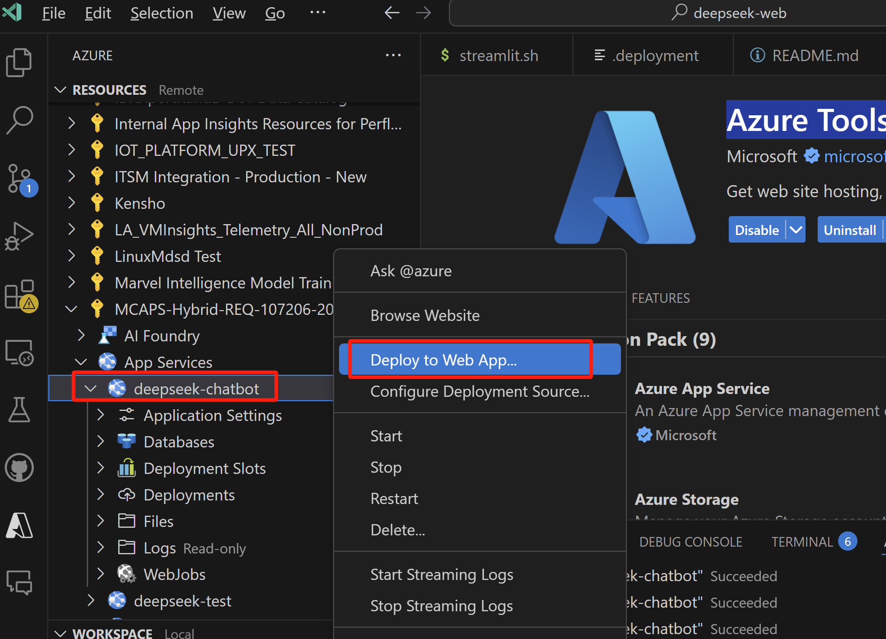
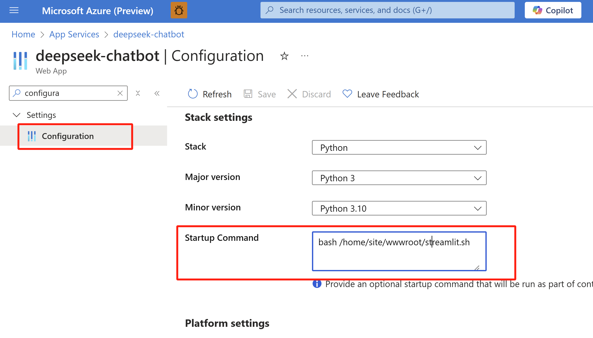
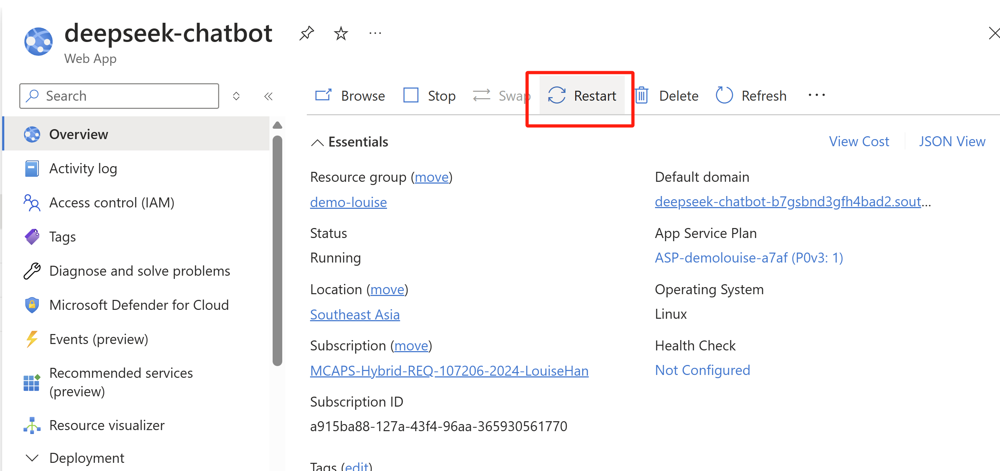

# Tutorial of creating a web application chatbot with Deepseek R1 model
## Pre-requisite
1. Azure Subscription - Trial or Paid
2. [Python Installation](https://www.python.org/downloads/) 
3. [Visual Studio Code Installation](https://code.visualstudio.com/download), and install [Azure Tools Extension](https://marketplace.visualstudio.com/items?itemName=ms-vscode.vscode-node-azure-pack).
4. Create an Azure Web Application resource in [Azure Portal](https://ms.portal.azure.com/#create/Microsoft.WebSite). (Tips: Create a Linux Python Web App, using Basic 1 SKU)

## 2. Deploy a Deepseek R1 model on Azure AI Foundry
Follow this tutorial: Deploy a [Deepseek model](https://learn.microsoft.com/en-us/azure/ai-studio/how-to/deploy-models-serverless?tabs=azure-ai-studio)
Then you could go to **View Code** to get your key and endpoint, which you will use in the next steps.

## 3. Deploy code to Azure Web App
1. For this repo to your VS Code.
   `git clone https://github.com/jr-MS/deepseek-chatbot-webapp.git`
2. Go to chat_app.py file, update your own **key** and **endpoint** of your deepseek deployment.
3. Go to VS Code Azure Extension, choose *Deploy to web app* using forked project.

4. On Azure, find the Python app and modify the startup command as follows, then restart the app.
   `bash /home/site/wwwroot/streamlit.sh`

5. Restart the web app.

Now, you can go to the web app site and chat with your deepseek model!☺️
